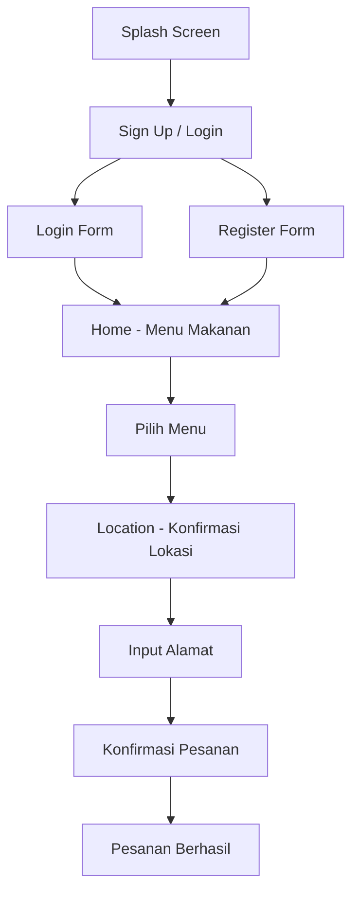

# 🍜 Mesen Makanan - Food Ordering App

Aplikasi pemesanan makanan berbasis Android yang dibuat menggunakan Kotlin. Aplikasi ini memungkinkan pengguna untuk melihat menu makanan, memilih pesanan, dan melakukan checkout dengan mengisi alamat pengiriman.

## 📱 Screenshots

<div style="display: flex; gap: 10px;">
  
  
  
  

  
  
</div>

## ✨ Fitur

- 🔐 **Authentication System**
  - Login
  - Register
  - Session management dengan Intent

- 🍽️ **Menu Makanan**
  - Tampilan 10 menu makanan dengan gambar
  - Informasi harga dan deskripsi
  - Scroll view untuk navigasi yang smooth

- 📍 **Location & Delivery**
  - Pilih lokasi pengiriman
  - Input alamat lengkap
  - Konfirmasi pesanan

- 🧭 **Bottom Navigation**
  - Home
  - Order
  - Profile

## 🛠️ Tech Stack

- **Language**: Kotlin
- **IDE**: Android Studio
- **Minimum SDK**: API 21 (Android 5.0 Lollipop)
- **Target SDK**: API 34
- **Architecture**: Activity-based
- **UI**: XML Layouts

## 📦 Dependencies

```gradle
dependencies {
    implementation("androidx.core:core-ktx:1.12.0")
    implementation("androidx.appcompat:appcompat:1.6.1")
    implementation("com.google.android.material:material:1.11.0")
    implementation("androidx.constraintlayout:constraintlayout:2.1.4")
}
```

## 📂 Struktur Project

```
app/
├── src/
│   └── main/
│       ├── java/com/example/utsproject/
│       │   ├── MainActivity.kt              # Screen 1: Splash
│       │   ├── SignUpActivity.kt            # Screen 2: Pilihan Login/Register
│       │   ├── LoginActivity.kt             # Screen 3: Form Login
│       │   ├── RegisterActivity.kt          # Screen 4: Form Register
│       │   ├── HomeActivity.kt              # Screen 5: Menu Makanan
│       │   ├── LocationActivity.kt          # Screen 6: Lokasi Pengiriman
│       │   ├── AddressActivity.kt           # Screen 7: Input Alamat
│       │   └── AddressDetailActivity.kt     # Screen 8: Konfirmasi
│       │
│       ├── res/
│       │   ├── layout/
│       │   │   ├── activity_main.xml
│       │   │   ├── activity_signup.xml
│       │   │   ├── activity_login.xml
│       │   │   ├── activity_register.xml
│       │   │   ├── activity_home.xml
│       │   │   ├── activity_location.xml
│       │   │   ├── activity_address.xml
│       │   │   └── activity_address_detail.xml
│       │   │
│       │   └── drawable/
│       │       ├── button_background.xml
│       │       ├── button_outline.xml
│       │       ├── edittext_background.xml
│       │       ├── card_background.xml
│       │       ├── ic_home.xml
│       │       ├── ic_order.xml
│       │       ├── ic_profile.xml
│       │       └── (gambar menu makanan)
│       │
│       └── AndroidManifest.xml
```

## 🚀 Cara Install

### Prerequisites

- Android Studio Arctic Fox atau lebih baru
- JDK 11 atau lebih tinggi
- Android SDK API 21+

### Langkah Instalasi

1. **Clone repository**
   ```bash
   git clone https://github.com/username/mesen-makanan.git
   cd mesen-makanan
   ```

2. **Buka di Android Studio**
   - Buka Android Studio
   - File → Open
   - Pilih folder project yang sudah di-clone

3. **Sync Gradle**
   - Tunggu proses Gradle sync selesai
   - Jika ada error, klik "Sync Project with Gradle Files"

4. **Tambahkan Gambar Menu (Opsional)**
   - Download gambar makanan
   - Rename sesuai nama file:
     - `nasi_goreng.jpg/png`
     - `mie_ayam.jpg/png`
     - `ayam_goreng.jpg/png`
     - `soto_ayam.jpg/png`
     - `rendang.jpg/png`
     - `gado_gado.jpg/png`
     - `bakso.jpg/png`
     - `nasi_uduk.jpg/png`
     - `sate_padang.jpg/png`
     - `nasi_kuning.jpg/png`
   - Copy ke folder `app/src/main/res/drawable/`

5. **Run App**
   - Pilih emulator atau device
   - Klik tombol Run (▶️)

## 📖 User Flow



## 🎨 Design Pattern

### Activity Lifecycle
- Menggunakan `Activity` class untuk setiap screen
- Data passing menggunakan `Intent.putExtra()`
- State management dengan `savedInstanceState`

### UI Pattern
- XML-based layouts
- Drawable resources untuk styling
- ScrollView untuk konten yang panjang
- LinearLayout untuk menu items

## 📝 Menu Makanan

| No | Menu | Harga |
|----|------|-------|
| 1 | Nasi Goreng | Rp 25.000 |
| 2 | Mie Ayam | Rp 20.000 |
| 3 | Ayam Goreng + Nasi | Rp 30.000 |
| 4 | Soto Ayam | Rp 22.000 |
| 5 | Rendang + Nasi | Rp 35.000 |
| 6 | Gado-Gado | Rp 18.000 |
| 7 | Bakso Kuah | Rp 23.000 |
| 8 | Nasi Uduk Komplit | Rp 28.000 |
| 9 | Sate Padang | Rp 32.000 |
| 10 | Nasi Kuning Tumpeng | Rp 27.000 |

## 🔧 Konfigurasi

### AndroidManifest.xml

```xml
<application
    android:allowBackup="true"
    android:icon="@mipmap/ic_launcher"
    android:label="Mesen Makanan"
    android:theme="@style/Theme.MesenMakanan">
    
    <activity android:name=".MainActivity" android:exported="true">
        <intent-filter>
            <action android:name="android.intent.action.MAIN" />
            <category android:name="android.intent.category.LAUNCHER" />
        </intent-filter>
    </activity>
    
    <!-- Activities lainnya -->
</application>
```

## 🐛 Known Issues

- Tidak ada database storage (data hilang setelah restart)
- Tidak ada GPS integration (placeholder saja)
- Tidak ada payment gateway
- Gambar menu menggunakan placeholder jika tidak di-upload

## 📈 Future Improvements

- [ ] Integrasi dengan Firebase untuk authentication
- [ ] Menambahkan Realtime Database untuk menyimpan pesanan
- [ ] Integrasi Google Maps untuk lokasi
- [ ] Payment gateway integration
- [ ] Order history
- [ ] User profile management
- [ ] Push notifications
- [ ] Dark mode support

## 👨‍💻 Developer

**Your Name**
- GitHub: [@dnjwna](https://github.com/dnjwna)
- Email: danujuwana05@gmail.com

## 🙏 Acknowledgments

- Icon resources dari Material Icons
- Inspirasi design dari aplikasi food delivery modern
- Tutorial dan guidance dari Android Developer Documentation

---

⭐ Jangan lupa kasih star jika project ini membantu! ⭐
